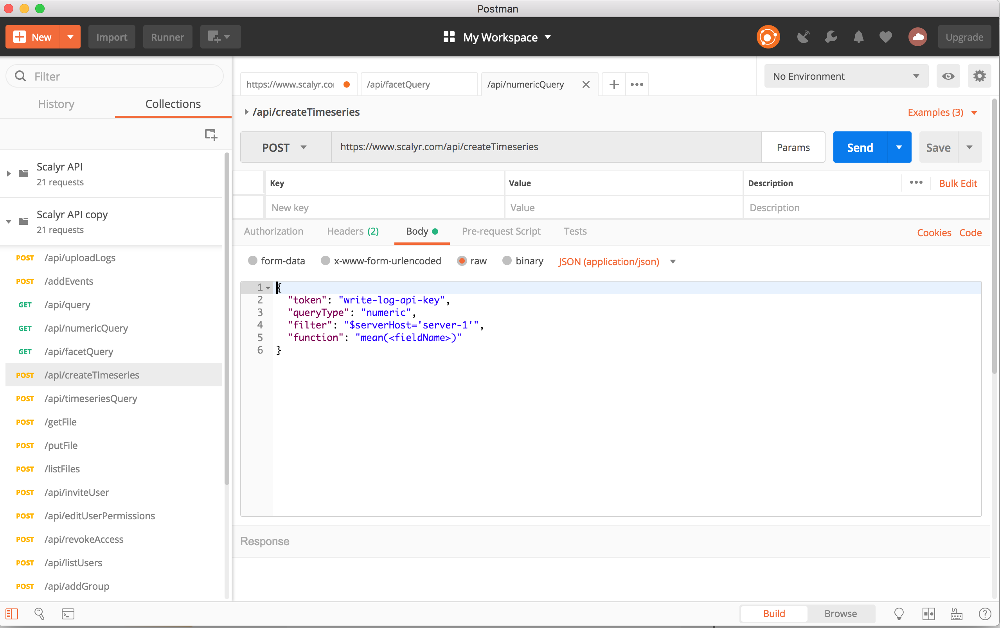
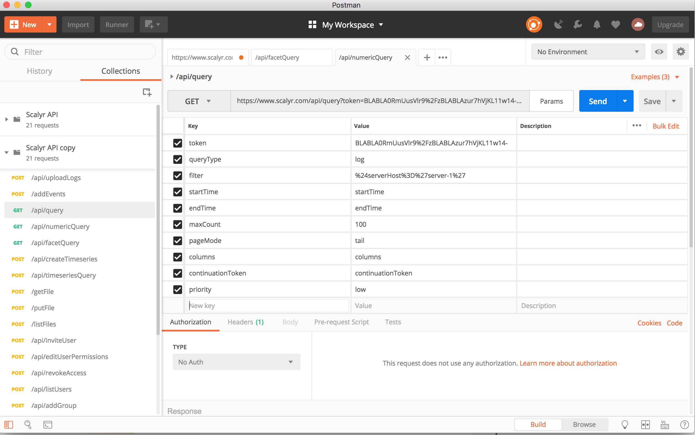
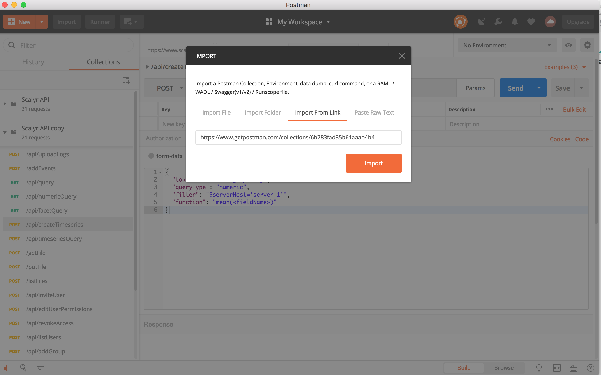

# scalyr-postman
This project contains ready-to-be used Postman "Collections 2.0" spec for [Scalyr.com API's](https://www.scalyr.com/help/api)  all 21 endpoints 

<a href="https://www.getpostman.com/">Postman</a> is an extremely popular app used by millions of developers to interact with API endpoints. Postman comes with a cool specification/feature called "collections" that allows people to share a set of APIs with others with **pre-populated sample data, headers, url params, etc**. 

#### 🔥🔥  This means other developers just have import the "collection" spec and simply change the data as needed and interact with the API endpoints right away without worrying about if they are passing the data properly or not!

## 🌟 HTTP POST 
(already pre-populated sample data, headers, urls, etc)

## 🌟 HTTP GET 
(already pre-populated sample data, headers, urls etc)

## 🚀 Quick start
1. Open Postman | Import | Import From Link and paste: `https://www.getpostman.com/collections/6b783fad35b61aaab4b4` and import

2. Start using it by changing the data as needed.

## Notes:
- The collection itself is a port from [oas3.yaml](https://github.com/rajaraodv/scalyr-oas3/blob/master/oas3.yaml) from [Scalyr-oas3](project).
- OAS3.0 was converted to Postman collection 2.0 by using [APIMatic](https://apimatic.io/transformer)
- If you update oas3.0 spec on [scalyr-oas3](https://github.com/rajaraodv/scalyr-oas3), please regenerate the postman-collections2.0.json to keep everything upto date.

## License
MIT